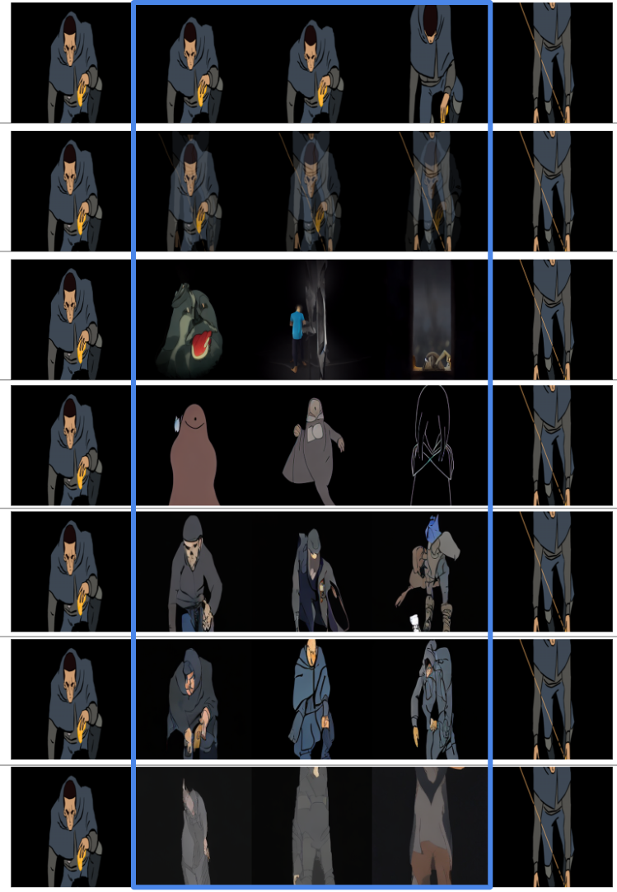
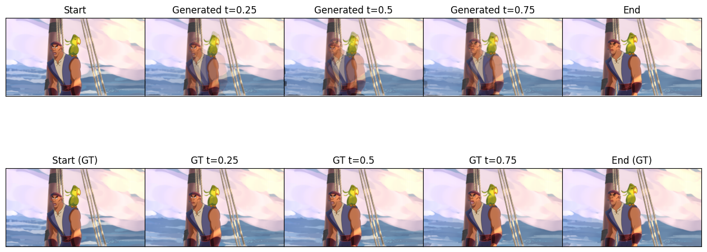
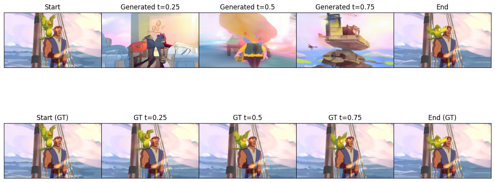
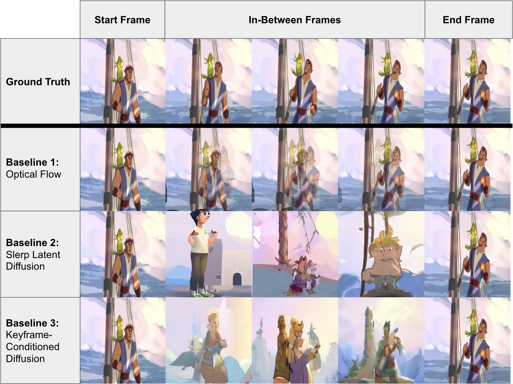
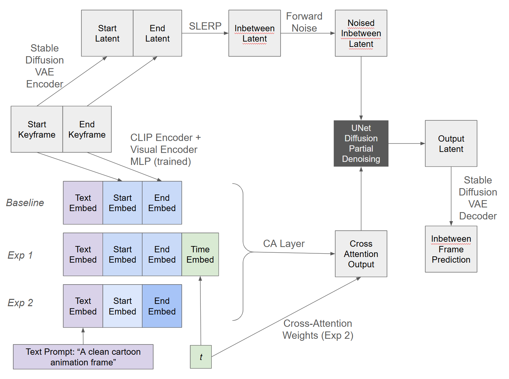
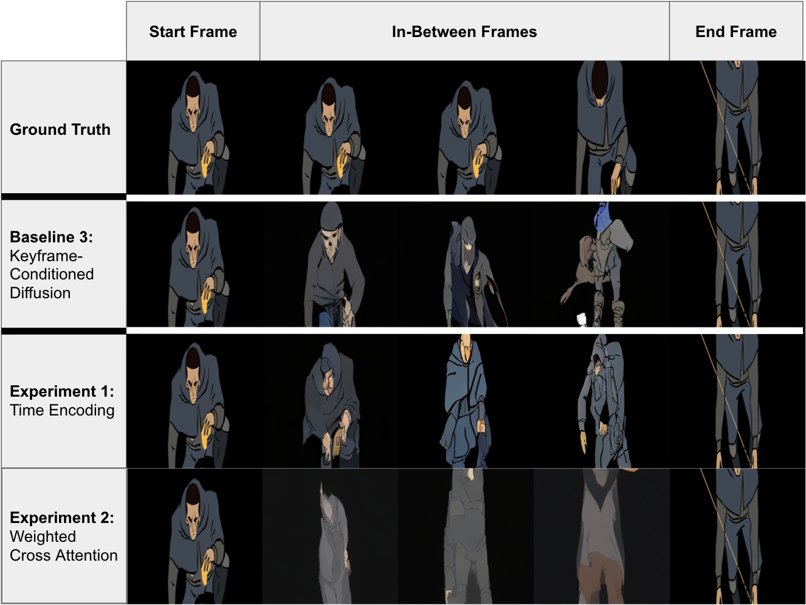

# Teaching AI to Animate Between Frames 🎬



**What if AI could handle the tedious parts of animation, letting artists focus on the creative work?**

We built a timestep-conditioned diffusion model that generates intermediate animation frames between keyframes. Think of it as teaching AI to understand motion over time—not just blending images, but actually learning what "25% of the way there" means in animation space.

**Team:** Maitri Gada, Prachi Patil, Sukriti Rawal | **Course:** CMU 10-423 Generative AI, Fall 2025

---

## The Challenge 🎯

Hand-drawn animation studios have a workflow problem. For every second of animation, artists need to draw 12-24 frames. The creative directors draw the important "keyframes," but junior animators spend weeks filling in the frames between them—a process called in-betweening. It's repetitive, expensive, and keeps talented people from doing more creative work.

We wanted to automate this.


---

## Our Approach 🚀

We experimented with **5 different methods**, from classical computer vision to cutting-edge diffusion models:

### The Baselines (What Already Exists)



**1. Optical Flow** - The old-school approach that tracks pixel movement between frames. Fast but produces blurry results with complex motion.



**2. Naive Diffusion** - Can we just interpolate in latent space and let Stable Diffusion handle the rest? (Spoiler: not quite)



**3. Keyframe-Conditioned Diffusion** - Fine-tuned Stable Diffusion to accept both keyframes as conditioning input. This became our main benchmark.

### The Innovation (What We Built)



Here's where it gets interesting. Most existing methods treat keyframes symmetrically—they don't explicitly tell the model *when* each frame should happen. We thought: what if the model knew exactly where in time it is?

**Experiment 1: Temporal Encoding ⭐**  
We created a learned timestep embedding that tells the model "you're generating the frame that's 25% between start and end" (or 50%, or 75%). This encoding gets mixed into the diffusion process, giving the model explicit temporal awareness.

**Experiment 2: Weighted Cross-Attention**  
We modified how the model pays attention to each keyframe. Frames early in the sequence should look more at the start keyframe, frames near the end should focus on the end keyframe. We implemented this with dynamic attention weighting based on timestep.



---

## What We Achieved 📊

### The Numbers

Our **Temporal Encoding** approach outperformed all other diffusion-based methods:

| Method | SSIM ↑ | LPIPS ↓ | Temporal Coherence ↓ |
|--------|--------|---------|----------------------|
| 🏆 **Our Temporal Encoding** | **0.565** | **0.438** | **0.432** |
| Keyframe-Conditioned Baseline | 0.540 | 0.454 | 0.463 |
| Naive Slerp Diffusion | 0.601 | 0.438 | 0.444 |
| Weighted Cross-Attention | 0.517 | 0.463 | 0.462 |

*Note: Optical flow scored highest overall (SSIM: 0.795) but produces noticeably blurry frames. It wins on metrics because it directly warps original pixels.*

### What This Means

- ✅ **Explicit timestep conditioning works** - telling the model where in time it is produces better, more coherent motion
- ✅ **Better than the baseline** - our approach beat the standard keyframe-conditioning across all metrics
- ✅ **Learned temporal understanding** - the model actually learned what fractional progress means in animation space
- ⚠️ **Data hungry** - diffusion models need lots of training data; our 16K frame dataset was on the smaller side

---

## The Technical Deep Dive 🔧

### What We Built With

- **Base Model:** Stable Diffusion 1.5 (image-conditioned variant from LambdaLabs)
- **Dataset:** Anita Dataset—16,000 hand-drawn animation frames from 14 professional animation sequences
- **Framework:** PyTorch + Hugging Face Diffusers
- **Compute:** ~110 GPU hours on AWS EC2 (g4dn.xlarge)

### Key Technical Decisions

**1. Conditioning Strategy**  
We tried VAE latents, CLIP embeddings, and patch-based features. CLIP global embeddings won—they provide clean semantic signals while the slerped latent handles spatial structure.

**2. Starting Point Matters**  
Instead of denoising from pure noise, we start from a slerped latent between the keyframes. This preserves background layout and subject positioning way better.

**3. Fine-Tuning Strategy**  
We froze most of the model and only trained cross-attention parameters. This prevents catastrophic forgetting while adapting to our specific task.

### The Code

```
src/
├── dataset.py                                  # Custom dataloader for animation sequences
├── eval.py                                     # Evaluation metrics (SSIM, LPIPS, etc.)
├── visualize.py                                # Generate comparison visualizations
└── models/
    ├── Baseline1_OpticalFlow.py               # Classical computer vision approach
    ├── Baseline2_SlerpLatentDiffusion.py      # Naive diffusion baseline
    ├── Baseline3_KeyframeConditionedDiffusion.py
    ├── Experiment1_TimeEncodingDiffusion.py   # 🌟 Our main contribution
    └── Experiment2_WeightedCrossAttention.py  # Alternative attention mechanism
```

---

## What We Learned 💡

### Things That Worked

✅ **Timestep embeddings are powerful** - Adding explicit temporal information gave the model a much clearer signal about what to generate

✅ **Pretrained models are a great starting point** - Fine-tuning image-conditioned Stable Diffusion was way more effective than training from scratch

✅ **Slerp initialization is crucial** - Starting denoising from interpolated latents instead of random noise dramatically improved stability

### Things That Didn't

❌ **Linear attention weighting was too simple** - Our weighted cross-attention experiment showed that naive linear weighting overwrites learned patterns

❌ **Small dataset limitations** - Using 5-frame sequences as training examples left us with only ~3,200 training samples—not enough to fully fine-tune a large model

❌ **Metrics vs. visual quality** - Optical flow wins on metrics but produces blurrier results. This taught us that evaluation in generative tasks is nuanced

### If We Had More Time/Resources

- 🎯 Scale to Sakuga-42M dataset (much larger, more diverse animation data)
- 🎯 Test variable-length generation (our timestep approach should generalize to any number of frames)
- 🎯 Implement learned attention weighting instead of linear
- 🎯 Combine with structural priors (edges, poses) for even better results

---

## Try It Yourself 🛠️

```bash
# Install dependencies
pip install -r requirements.txt

# Run the notebook
jupyter notebook run.ipynb
```

The notebook includes:
- Loading pretrained models
- Running inference on test sequences  
- Generating evaluation metrics
- Creating side-by-side visualizations

---

## The Impact 🌟

This project demonstrates:

- **Novel application of diffusion models** - timestep-conditioning for animation is an underexplored area
- **Rigorous experimentation** - we implemented 5 different methods and compared them systematically
- **Real-world relevance** - animation studios could use this to speed up production pipelines
- **Technical depth** - custom conditioning strategies, attention mechanism modifications, and careful evaluation

Animation in-betweening is a multi-million dollar problem in the animation industry. While our approach needs more data and training to be production-ready, we've shown that **explicit temporal conditioning improves diffusion-based frame generation**—a finding that could inform future work in video generation, animation tools, and temporal modeling.

---

## References & Resources

📄 [Full Technical Implementation](https://github.com/sukritirawal1/timestep-conditioned-inbetweening/tree/main)  
🎨 [Anita Dataset](https://zhenglinpan.github.io/AnitaDataset_homepage/)  
🔬 [Stable Diffusion](https://stability.ai/stable-diffusion)

**Related Research:**
- Cohan et al. (2024) - Flexible Motion In-betweening with Diffusion Models
- Qin et al. (2024) - Robust Diffusion-based Motion In-betweening  
- Disney Research (2024) - Factorized Motion Diffusion

---

## About Us

**Maitri Gada** | **Prachi Patil** | **Sukriti Rawal**

We're graduate students at Carnegie Mellon University passionate about generative AI and its creative applications. This project was completed as part of 10-423/623 Generative AI in Fall 2025.


---

<sub>Built with ❤️ and a lot of GPU hours</sub>
